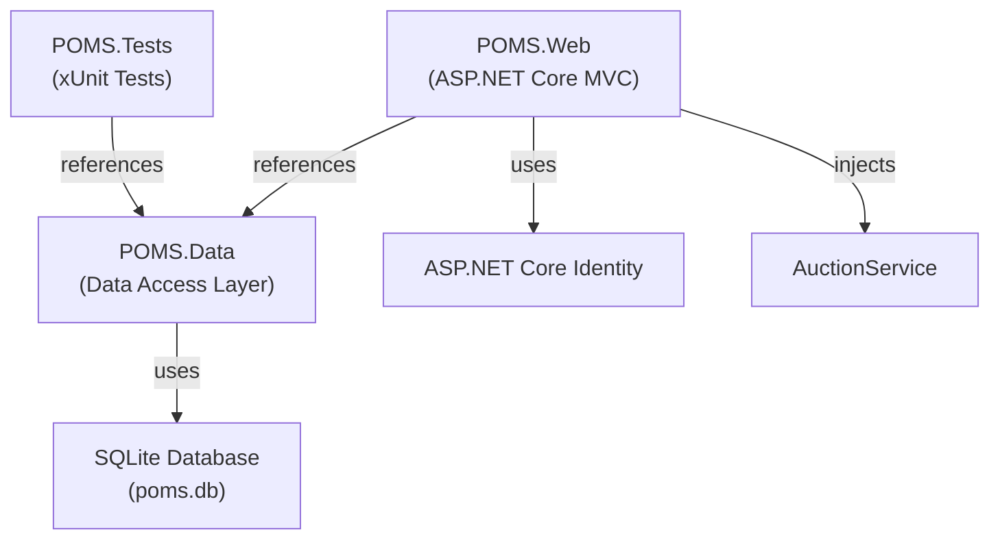
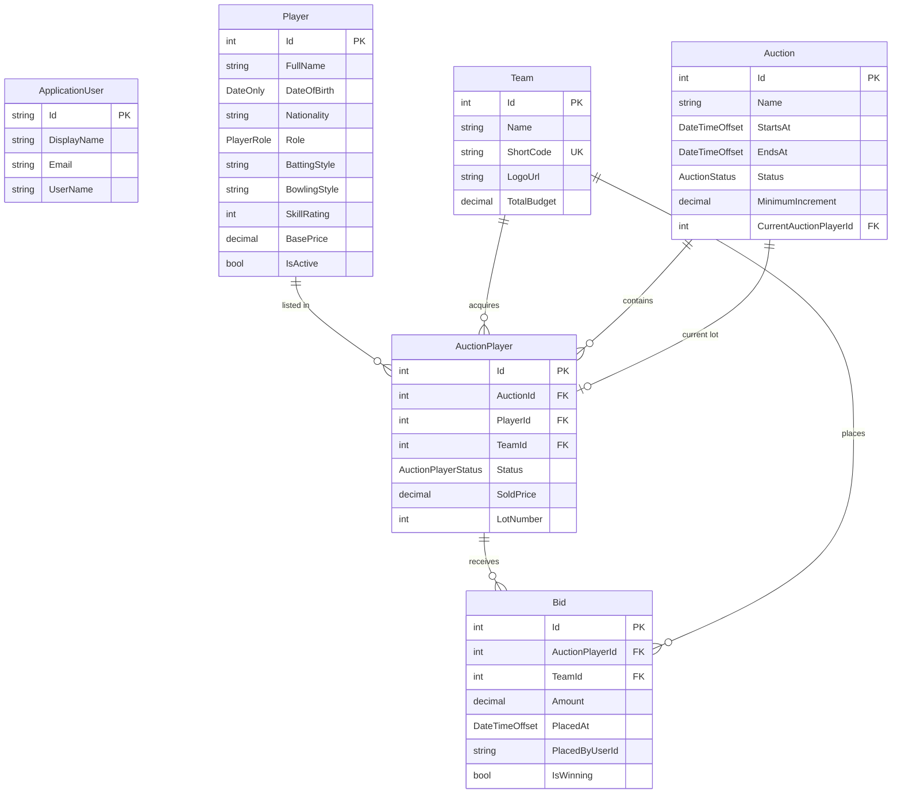
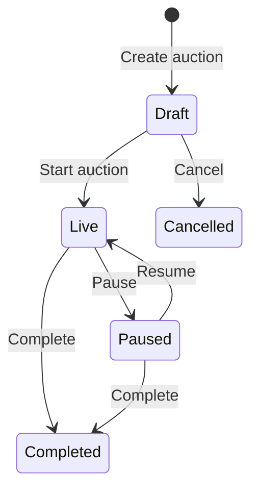
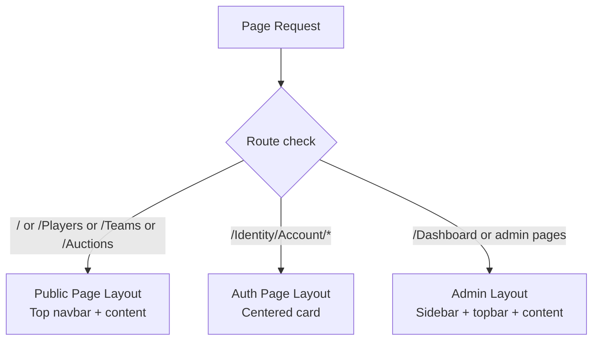

# 🏏 POMS — Cricket Auction Manager

> **Player & Operations Management System (POMS)** — A professional command center for cricket player auctions built with .NET 8, ASP.NET Core MVC, Entity Framework Core, and SQLite.

---

## 📑 Table of Contents

- [Project Overview](#-project-overview)
- [Technology Stack](#-technology-stack)
- [Solution Architecture](#-solution-architecture)
- [Database Schema](#-database-schema)
- [Features & Modules](#-features--modules)
- [Authentication & Authorization](#-authentication--authorization)
- [UI/UX Design](#-uiux-design)
- [Testing](#-testing)
- [Configuration](#-configuration)
- [Getting Started](#-getting-started)

---

## 🎯 Project Overview

| Property         | Value                                       |
|------------------|---------------------------------------------|
| **Project Name** | POMS (Cricket Auction Manager)              |
| **Type**         | ASP.NET Core 8 MVC Web Application          |
| **Database**     | SQLite (auto-created at `App_Data/poms.db`) |
| **Pattern**      | MVC + Service Layer + EF Core (Code-First)  |
| **Author**       | Md. Shahinur Rahman Polas                   |

POMS is a full-featured cricket player auction management workspace. It enables operators to manage player pools, team budgets, lot queues, and live bidding — all from a single professional interface. The application supports a complete auction lifecycle from **Draft → Live → Paused → Completed**.

---

## 🛠 Technology Stack

### Backend

| Technology                              | Version  | Purpose                                     |
|-----------------------------------------|----------|---------------------------------------------|
| **.NET SDK**                            | 8.0      | Runtime & build platform                    |
| **ASP.NET Core MVC**                    | 8.0      | Web framework (Controllers + Razor Views)   |
| **Entity Framework Core**              | 8.0.31   | ORM / data access (Code-First)              |
| **EF Core SQLite Provider**            | 8.0.31   | SQLite database connectivity                |
| **ASP.NET Core Identity**              | 8.0.31   | Authentication & authorization              |
| **ASP.NET Core Identity UI**           | 8.0.31   | Scaffolded Identity Razor Pages             |
| **EF Core Tools**                      | 8.0.31   | Migrations & database management            |
| **EF Core Diagnostics**               | 8.0.31   | Developer exception filter for EF errors    |
| **C# 12**                              | Latest   | Language features (primary constructors, etc.) |

### Frontend

| Technology               | Version | Purpose                                 |
|--------------------------|---------|-----------------------------------------|
| **Razor Views (`.cshtml`)** | —     | Server-side rendered HTML templates     |
| **Bootstrap**            | 5.3.3   | CSS framework (via CDN)                 |
| **Google Fonts**         | —       | DM Sans + Manrope typography            |
| **Custom CSS**           | —       | `site.css` + `matchday.css` (AdminLTE-inspired) |
| **Vanilla JavaScript**   | —       | Sidebar collapse with localStorage persistence |

### Testing

| Technology                   | Version | Purpose                       |
|------------------------------|---------|-------------------------------|
| **xUnit**                    | 2.5.3   | Unit test framework           |
| **xUnit Visual Studio Runner** | 2.5.3 | VS Test Explorer integration  |
| **Microsoft.NET.Test.Sdk**   | 17.8.0  | Test SDK                      |
| **Coverlet**                 | 6.0.0   | Code coverage collector       |
| **SQLite In-Memory**         | 8.0.31  | In-memory test database       |

### Infrastructure & Tooling

| Technology        | Purpose                                |
|-------------------|----------------------------------------|
| **SQLite**        | Embedded file-based relational database |
| **User Secrets**  | Development credential management       |
| **IIS Express**   | Local development server                |
| **Kestrel**       | Built-in ASP.NET Core web server        |

---

## 🏗 Solution Architecture

The solution follows a **layered architecture** with three projects:



### Project Breakdown

#### 📦 `POMS.Data` — Data Access Layer
- **[`ApplicationDbContext.cs`](file:///j:/Projects/POMS/POMS.Data/ApplicationDbContext.cs)** — EF Core DbContext inheriting `IdentityDbContext<ApplicationUser>` with Fluent API configuration
- **[`Models/Entities.cs`](file:///j:/Projects/POMS/POMS.Data/Models/Entities.cs)** — Domain entities: `ApplicationUser`, `Player`, `Team`, `Auction`, `AuctionPlayer`, `Bid`
- **[`Models/Enums.cs`](file:///j:/Projects/POMS/POMS.Data/Models/Enums.cs)** — Enums: `PlayerRole`, `AuctionStatus`, `AuctionPlayerStatus`
- **[`Services/AuctionService.cs`](file:///j:/Projects/POMS/POMS.Data/Services/AuctionService.cs)** — Core auction business logic (bidding, lifecycle, validation)

#### 🌐 `POMS.Web` — Web Application
- **5 Controllers**: `HomeController`, `DashboardController`, `PlayersController`, `TeamsController`, `AuctionsController`
- **13 Razor Views** across Home, Dashboard, Players, Teams, Auctions, and Shared
- **2 Identity Razor Pages**: Login & Register (custom scaffolded)
- **Static assets**: `site.css`, `matchday.css`, `site.js`

#### 🧪 `POMS.Tests` — Unit Tests
- **[`AuctionServiceTests.cs`](file:///j:/Projects/POMS/POMS.Tests/AuctionServiceTests.cs)** — 4 xUnit tests covering core auction business rules

---

## 🗄 Database Schema



### Key Constraints & Indexes

| Constraint | Description |
|---|---|
| `Team.ShortCode` | Unique index |
| `AuctionPlayer(AuctionId, LotNumber)` | Unique composite index — no duplicate lot numbers per auction |
| `AuctionPlayer(AuctionId, PlayerId)` | Unique composite index — a player can only appear once per auction |
| `Player.FullName` | Non-unique index for search |
| `AuctionPlayer → Auction` | Cascade delete |
| `AuctionPlayer → Player` | Restrict delete (preserves player history) |
| `AuctionPlayer → Team` | SetNull on delete |
| `Bid → AuctionPlayer` | Cascade delete |
| `Bid → Team` | Restrict delete |
| `Auction → CurrentAuctionPlayer` | SetNull on delete |

### Enumerations

| Enum | Values |
|---|---|
| `PlayerRole` | `Batter`, `Bowler`, `AllRounder`, `Wicketkeeper` |
| `AuctionStatus` | `Draft`, `Live`, `Paused`, `Completed`, `Cancelled` |
| `AuctionPlayerStatus` | `Pending`, `OnAuction`, `Sold`, `Unsold` |

---

## ✨ Features & Modules

### 1. 🏠 Landing Page (Public)
- **Hero section** with animated grid background, gradient orbs, and live console preview card
- **Statistics bar** displaying real-time counts: active players, registered teams, auctions hosted, total team budget
- **Feature highlights**: Curate the Pool, Protect the Purse, Run the Room
- **Workflow panel**: Configure → Shortlist → Bid → Announce

### 2. 📊 Dashboard (Authenticated)
- **KPI stat cards**: Active players, Registered teams, Auctions hosted, Total team budget
- **Live auction status panel** with direct links to the live console
- **Quick action shortcuts**: Player pool, Team directory, New auction
- **Recent auctions table** with status badges, lot counts, and direct links
- **AdminLTE-inspired admin layout** with collapsible dark sidebar navigation

### 3. ♙ Player Management
| Feature | Details |
|---|---|
| **List & Search** | Tabular view with name search, role, skill rating, base price, status |
| **Create Player** | Form: full name, date of birth, nationality, role (dropdown), batting/bowling style, skill rating (1–100), base price |
| **Edit Player** | Update all player attributes |
| **Soft Delete (Archive)** | Marks player as `IsActive = false` instead of hard delete |
| **Public/Auth Views** | Public users see read-only; authenticated users get edit/create actions |

### 4. ◉ Team Management
| Feature | Details |
|---|---|
| **Team Directory** | Card-based grid with team initial, name, short code badge, acquired player count, total purse |
| **Create Team** | Form: name, short code (unique), logo URL, total budget |
| **Edit Team** | Update all team attributes |
| **Team Details** | Squad view showing all acquired auction players across all auctions with player names, roles, and auction context |
| **Budget Tracking** | Total budget displayed per team; enforced during bidding |

### 5. ◈ Auction Management
| Feature | Details |
|---|---|
| **Auction List** | Table with name, status badge, player/lot count, start date |
| **Create Auction** | Set auction name, minimum bid increment, start/end dates |
| **Auction Details** | Lot list table, auction controls panel, player addition (draft only) |
| **Add Players** | Multi-select checkbox to add players to auction lots (draft only) |
| **Auto Lot Numbering** | Automatic sequential lot numbers assigned on player addition |
| **Duplicate Prevention** | Prevents adding the same player twice to an auction |

### 6. 🎙 Auction Lifecycle & State Machine



| Transition | Validation |
|---|---|
| Draft → Live | At least one player must be in the lot list |
| Live → Paused | Only live auctions can be paused |
| Paused → Live | Only paused auctions can resume |
| Live/Paused → Completed | Sets `EndsAt` timestamp |

### 7. 📣 Live Auction Console (Operator Workspace)
The crown jewel of the application — a full operator workspace for running live auctions:

| Feature | Details |
|---|---|
| **Auto-detection** | Automatically finds the active (Live/Paused) auction |
| **Player on the block** | Large center stage showing current player's name, role, skill rating, and base price |
| **Highest bid display** | Prominent display of current winning bid amount and team |
| **Lot queue sidebar** | Dropdown selector for pending players with lot numbers and base prices, with count badge |
| **Bid placement form** | Team selector (with purse info), amount input, minimum bid hint |
| **Bid history table** | Audit trail showing team, bid amount, timestamp, with winning bid highlighted |
| **Sold/Unsold actions** | Close lot as Sold (requires winning bid) or Unsold |
| **Status alerts** | Contextual warnings for paused/draft states |
| **Empty state** | Guided setup steps when no auction is live (Create → Build lots → Go live) |

### 8. 💰 Bidding Engine (Core Business Logic)
The [`AuctionService`](file:///j:/Projects/POMS/POMS.Data/Services/AuctionService.cs) enforces comprehensive bidding rules:

| Rule | Implementation |
|---|---|
| **Minimum increment** | Bid must exceed highest bid (or base price) by at least `MinimumIncrement` |
| **Self-bid prevention** | A team cannot outbid itself (prevents accidental self-competition) |
| **Budget enforcement** | Bid amount cannot exceed team's remaining budget (total budget minus winning bids in the auction) |
| **Lot state validation** | Only `OnAuction` lots accept bids; auction must be `Live` |
| **Current lot check** | Bids only accepted for the player currently on the block |
| **Transaction safety** | Uses explicit database transactions (`BeginTransactionAsync`) for bid atomicity |
| **Winning bid tracking** | Previous winning bids are unmarked; new bid marked as `IsWinning` |
| **Sold validation** | A player cannot be marked sold without an existing winning bid |

### 9. 📋 Data Seeding (Auto-Setup)
On first startup, the application automatically seeds:
- **Admin role** (`Admin`)
- **Admin user** (`admin@poms.local` / `Admin@123!`) with `DisplayName = "System Administrator"`
- **2 sample teams**: Mumbai Mavericks (MM, ₹12M budget), Delhi Dynamos (DD, ₹12M budget)
- **3 sample players**: Arjun Sharma (Batter, 88), Liam Smith (Bowler, 85), Kai Johnson (AllRounder, 90)

---

## 🔐 Authentication & Authorization

| Feature | Implementation |
|---|---|
| **Framework** | ASP.NET Core Identity with `IdentityDbContext<ApplicationUser>` |
| **User model** | Custom `ApplicationUser` extending `IdentityUser` with `DisplayName` |
| **Roles** | Role-based with `IdentityRole` (seeded `Admin` role) |
| **Email confirmation** | Disabled (`RequireConfirmedAccount = false`) |
| **Custom pages** | Scaffolded Login & Register Razor Pages with custom UI |
| **Login redirect** | Successful login redirects to `/Dashboard` |
| **Register flow** | Auto sign-in after registration, redirect to Dashboard |
| **Route protection** | `[Authorize]` on controllers; `[AllowAnonymous]` on public endpoints |
| **Public vs Auth views** | Same views with conditional rendering — anonymous users see read-only; authenticated users get CRUD actions |

### Public vs. Authenticated Access Matrix

| Page | Anonymous | Authenticated |
|---|:---:|:---:|
| Home / Landing | ✅ | ✅ |
| Player List | ✅ (read-only) | ✅ (CRUD) |
| Team List | ✅ (read-only) | ✅ (CRUD) |
| Team Details | ✅ (read-only) | ✅ |
| Auction List | ✅ (read-only) | ✅ (CRUD) |
| Auction Details | ✅ (read-only) | ✅ (controls) |
| Live Console | ✅ (viewer mode — bids/actions hidden) | ✅ (full operator) |
| Dashboard | ❌ | ✅ |
| Player Create/Edit | ❌ | ✅ |
| Team Create/Edit | ❌ | ✅ |

---

## 🎨 UI/UX Design

### Design System

| Element | Detail |
|---|---|
| **Typography** | DM Sans (body) + Manrope (headings) via Google Fonts |
| **Color palette** | Dark navy/purple admin theme with amber/gold accents |
| **CSS Framework** | Bootstrap 5.3.3 (CDN) |
| **Custom themes** | `site.css` (landing/public) + `matchday.css` (admin/dashboard) |
| **Design inspiration** | AdminLTE-inspired workspace with modern SaaS aesthetic |

### Layout Modes (3-tier)



| Mode | CSS Class | Description |
|---|---|---|
| **Public** | `.public-page` | Clean landing-style with top navigation bar, warm ivory background |
| **Auth** | `.auth-page` | Centered card with minimal chrome, purple accents |
| **Admin** | `.admin-body` | Full AdminLTE-inspired workspace: collapsible sidebar, topbar, footer |

### Interactive Features
- **Collapsible sidebar** — Toggle with button, state persisted in `localStorage` (`poms-sidebar-collapsed`)
- **Responsive breakpoints** — Mobile-first with adaptations at 575px, 767px, 991px
- **Accessible sidebar** — Offcanvas on mobile via Bootstrap, fixed sidebar on desktop
- **Status badges** — Color-coded pills for auction states (Live = teal, Paused = amber, Draft = grey, Completed = blue)
- **TempData notifications** — Success (green) and Error (red) alert banners after actions
- **Reduced motion** — Respects `prefers-reduced-motion` media query

---

## 🧪 Testing

### Test Project: [`POMS.Tests`](file:///j:/Projects/POMS/POMS.Tests/POMS.Tests.csproj)

**Framework:** xUnit with SQLite in-memory databases

| Test | Validates |
|---|---|
| `First_bid_must_meet_increment_over_base_price` | Bid below minimum (base price + increment) is rejected |
| `Team_cannot_bid_against_itself` | Self-bidding prevention rule |
| `Team_bid_cannot_exceed_remaining_budget` | Budget enforcement validation |
| `Sold_player_requires_winning_bid_and_records_team` | Sold status requires a bid; correctly records price and team |

### Test Infrastructure
- **Reusable `Fixture` class** implementing `IAsyncDisposable`
- **SQLite in-memory** database (`DataSource=:memory:`) for fast, isolated tests
- **Auto-seeded test data**: 2 teams (₹1M budget each), 1 player, 1 live auction with active lot
- **AAA pattern** (Arrange–Act–Assert) throughout

---

## ⚙ Configuration

### [`appsettings.json`](file:///j:/Projects/POMS/POMS.Web/appsettings.json)
```json
{
  "ConnectionStrings": {
    "DefaultConnection": "Data Source=App_Data/poms.db;Cache=Shared"
  },
  "Logging": {
    "LogLevel": {
      "Default": "Information",
      "Microsoft.AspNetCore": "Warning"
    }
  },
  "AllowedHosts": "*"
}
```

### Launch Profiles

| Profile | URL | HTTPS |
|---|---|---|
| `http` | `http://localhost:5042` | No |
| `https` | `https://localhost:7295` | Yes |
| `IIS Express` | `http://localhost:21562` | Port 44314 |

### Key Middleware Pipeline
```
HttpsRedirection → StaticFiles → Routing → Authentication → Authorization → MVC → RazorPages
```

---

## 🚀 Getting Started

### Prerequisites
- .NET 8 SDK

### Run Locally
```powershell
dotnet run --project POMS.Web
```

The app auto-creates the SQLite database at `POMS.Web/App_Data/poms.db`.

### Seeded Credentials
| Field | Value |
|---|---|
| Email | `admin@poms.local` |
| Password | `Admin@123!` |

> [!CAUTION]
> Change the seeded credentials before deploying anywhere beyond local development.

### Run Tests
```powershell
dotnet test POMS.sln
```

---

## 📂 Project File Structure

```
POMS/
├── POMS.sln
├── README.md
├── POMS.Data/
│   ├── POMS.Data.csproj
│   ├── ApplicationDbContext.cs
│   ├── Models/
│   │   ├── Entities.cs          # Player, Team, Auction, AuctionPlayer, Bid
│   │   └── Enums.cs             # PlayerRole, AuctionStatus, AuctionPlayerStatus
│   └── Services/
│       └── AuctionService.cs    # Core bidding & lifecycle logic
├── POMS.Web/
│   ├── POMS.Web.csproj
│   ├── Program.cs               # Entry point, DI, seeding
│   ├── appsettings.json
│   ├── App_Data/
│   │   └── poms.db              # SQLite database (auto-created)
│   ├── Areas/Identity/Pages/Account/
│   │   ├── Login.cshtml(.cs)
│   │   └── Register.cshtml(.cs)
│   ├── Controllers/
│   │   ├── HomeController.cs
│   │   ├── DashboardController.cs
│   │   ├── PlayersController.cs
│   │   ├── TeamsController.cs
│   │   └── AuctionsController.cs
│   ├── Models/
│   │   └── ErrorViewModel.cs
│   ├── Views/
│   │   ├── Home/        (Index, Privacy)
│   │   ├── Dashboard/   (Index)
│   │   ├── Players/     (Index, Create, Edit)
│   │   ├── Teams/       (Index, Create, Edit, Details)
│   │   ├── Auctions/    (Index, Create, Details, Live)
│   │   └── Shared/      (_Layout, _LoginPartial, _PlayerCheckboxes, Error)
│   ├── Properties/
│   │   └── launchSettings.json
│   └── wwwroot/
│       ├── css/
│       │   ├── site.css          # Landing & public page styles
│       │   └── matchday.css      # Admin dashboard & theme styles
│       ├── js/
│       │   └── site.js           # Sidebar collapse interaction
│       └── favicon.ico
└── POMS.Tests/
    ├── POMS.Tests.csproj
    └── AuctionServiceTests.cs    # 4 xUnit tests for bidding rules
```

---

> **Built with ❤️ by Md. Shahinur Rahman Polas** — .NET Developer | Full Stack Engineer
